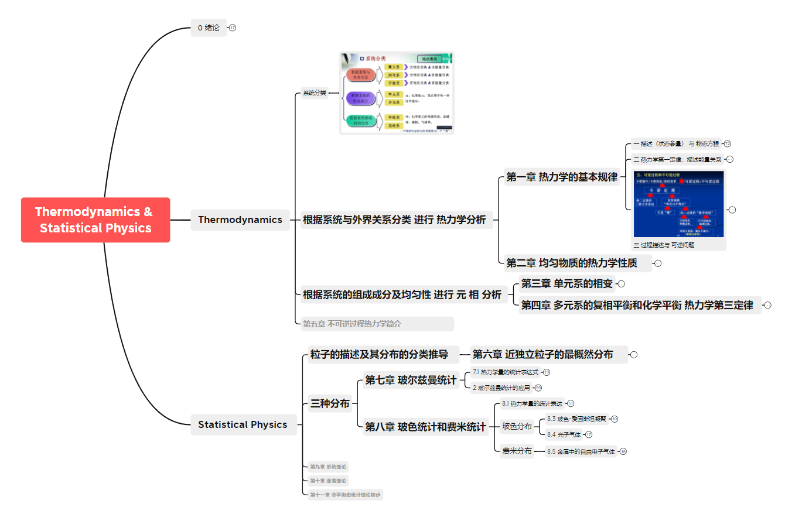

## 热力学与统计物理

四大力学之一。这门课难点在于知识点杂。

> 此课学艺不精，还是那句话学习一门课还是需要投入必要时间，去理解其中的逻辑。

我也补充了一些其他的教材，用于参考和复习。

> Statistical mechanics Entropy, Order parameters and complexity (James P. Sethna) 这本教材备受好评。

> 下文摘自教材

热力学和统计物理学的任务是：研究热运动的规律，研究与热运动有关的物性及宏观物质系统的演化。

**热力学和统计物理学的任务虽然相同，但研究的方法是不同的。**

热力学是热运动的**宏观**理论。通过对热现象的观测、实验和分析，人们总结出热现象的基本规律，这就是热力学第一定律、第二定律和第三定律，这几个基本规律是无数经验的总结，适用于一切宏观物质系统。也就是说，它们具有高度的可靠性和普遍性。热力学以这几个基本规律为基础，应用数学方法，通过逻辑演绎可以得出物质各种宏观性质之间的关系，宏观过程进行的方向和限度等结论。只要其中不加上其他假设，这些结论就具有同样的可靠性和普遍性。**普遍性是热力学的优点，我们可以应用热力学理论研究一切宏观物质系统**。但是，由热力学理论得到的结论与物质的具体结构无关，因此，根据热力学理论不可能导出具体物质的特性，在实际应用上必须结合实验观测的数据，才能得到具体的结果。此外，热力学理论不考虑物质的微观结构，把物质看作连续体，用连续函数表达物质的性质，因此不能解释涨落现象。这是热力学的局限性。

统计物理学是热运动的**微观**理论。统计物理学从宏观物质系统是由大量微观粒子所构成的这一事实出发，认为物质的宏观性质是大量微观粒子性质的集体表现，宏观物理量是微观物理量的统计平均值。由于统计物理学深入到热运动的本质，它就能够把热力学中三个相互独立的基本规律归结于一个基本的统计原理，阐明这三个定律的统计意义，**还可以解释涨落现象**。不仅如此，在对物质的微观结构作出某些假设之后，应用统计物理学理论还可以求得具体物质的特性，并阐明产生这些特性的微观机理。统计物理学也有它的局限性。由于统计物理学对物质的微观结构所作的往往只是简化的模型假设，所得的理论结果也就往往是近似的。当然，随着对物质结构认识的深入和理论方法的发展，统计物理学的理论结果也更加接近于实际。

## 给自己的一句话

四大力学，尤其是统计力学，让我有机会借助这样的高阶物理，我是非常感激学校给这样的安排。我可能当时学习的状态一直不好，没有尽力思考这门课的含金量。但是也正是接触这门学科的机会，让我开始思考统计力学的内容，于我，于世界，到底是怎样的运行逻辑。开始思考，很重要。